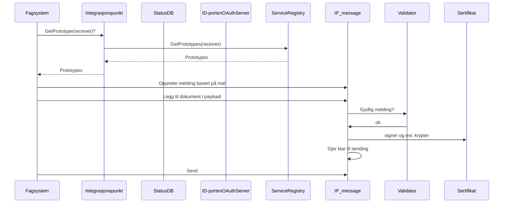

---
title: NextMove
description: Beskrivelse av forretningsmeldinger
permalink: about.html
layout: page
sidebar: eformidling
foler: NextMove
---

Under utarbeidelse av 2015:3 rapporten ble det identifisert at et viktig kriterie for sukess var mulighet for hurtig utbredelse uten endringer i loklale installsjoner. Dette gjorde at man i første omgang reimplemeterte BEST/EDU gresnsesnittet som allerede var støttet i de mest brukte Sak-/Arkikvløsningene. 
Det at dette er en reltaiv gammel "standard" som setter en del begrensninger i forhold til dagens behov har gjør det nødvendig å komme med et nytt grensetsnitt mot integrasjonspunktet, som bøter på utfordringer vi opplever med BEST/EDU

Hovedsaklig dreier dette seg om:
- Behov for flere avlevernede og mottakende system innenfor virksomhenene
- Behov for å kunne sende til privatpersoner
- Behov for nye meldingstyper
- Begrensinger på meldingsstørrelse
- Behov for bedre statusoppdateringer

NextMove ble valgt som arbiedsnavn på det nye konseptet da NextBest ga en litt uheldig klang 

NextMove er et REST bassert API på integrasjonspunktet

Adresseringen er i likhet med DPI og PEPPOL SBDH med en forettningsmelding.

Hver melding blir i utgangspunktet en unik ressurs i grensesnittet, og kan i løpet av livsløpet sitt spores og endres gjennom denne ressurslenken. 

For å sikre høyest mulig kvalitet så tilbyr grensesnittet oppslag mot hvilke typer meldinger det lokale endepunktet søtter, samt tilby mulighet til å hente ut maler/prototyper på meldinger. I praksis er dette de to ytterste lagene i meldingsstrukturen, det vil si konvolutten (SBDH) og det forretningsmeldingsformatet som er assosiert med meldingstypen. Innholdet som skal frem til mottaker blir lagt til med et egne kall, slik at det i fremtiden er mulig å støtte flere forskjellige løsninger (mellom annet tilpasse for opplasting av store filer).

Tanken med denne løsningsarkitekturen er at man skal kunne integrere individuelle/tilpassede valideringsløsninger for hver meldingstype. Et annet motiv er at man skal eliminere behovet for virksomhetssertifikater andre plasser enn i integrasjonspunktet.


Utgangspunktet er at hver melding består av tre nøstede lag:

<div class="mermaid">
graph LR
subgraph Melding
  subgraph Konvolutt 
    el1[<b>Standard Business Document Header</b><br/> brukt til ruting av meldingen frem til mottaker]  
    el2[<b>Forretningsmelding</b><br/>brukt til effektiv håndtering av mottak]
  end
  subgraph Innhold
    el3[<b>ASIC-E med innhold</b><br/>En eller flere filer med strukturert informasjon som skal frem til mottaker]
  end
end


</div>


Dette gir en sekvens på opplasting:



## SBDH 

Ekspempel på SBDH ved sending til annen organisasjon

```json
{
  "StandardBusinessDocument": {
    "StandardBusinessDocumentHeader": {
      "HeaderVersion": "1.0",
      "Sender": {
        "Identifier": {
          "Authority": "so6523-actorid-upis",
          "ID": "9908:910077473"
        }
      },
      "Receiver": {
        "Identifier": {
          "Authority": "so6523-actorid-upis",
          "ID": "9908:910075918"
        }
      },
      "DocumentIdentification": {
        "Standard": "urn:no:difi:meldingsutveksling:2.0",
        "TypeVersion": "2.0",
        "InstanceIdentifier": "ff88849c-e281-4809-8555-7cd54952b916",
        "Type": "digitaPost/noark5json", 
        "CreationDateAndTime": "2016-04-11T15:29:58.753+02:00"
      },
      "BusinessScope": {
        "Scope": {
          "Type": "ConversationId",
          "InstanceIdentifier": "37efbd4c-413d-4e2c-bbc5-257ef4a65a45",
          "Identifier": "urn:no:difi:meldingsutveksling:2.0"          
          }
        }
      }
    }
    "payload": {
        "Conversation": "Forettningsmelding",
    }
  }
}