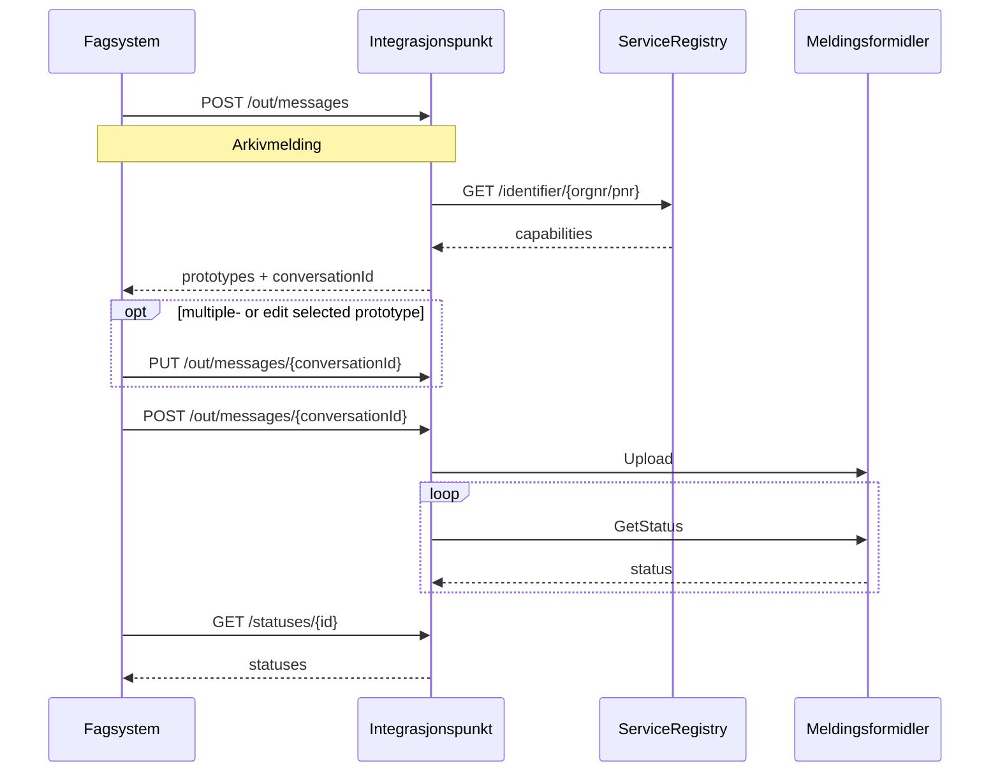

## Sende melding

sequenceDiagram
    participant fs as Fagsystem
    participant ip as Integrasjonspunkt
    participant sr as ServiceRegistry
    participant mf  as Meldingsformidler

    
    fs->>ip: GET /capabilities/{orgnr}
    ip->>sr: GET /identifier/{orgnr}
    sr-->>ip: capabilities
    ip-->>fs: capabilities
    fs->>fs: select capability
    fs->>ip: POST /out/messages
    ip-->>fs: conversationId
    fs->>ip: POST /out/messages/{conversationId}
    ip->>mf: Upload
    loop 
        ip->>mf: GetStatus
        mf-->>ip: status
    end
    fs->>ip: GET /statuses/{id}
    ip-->>fs: statuses

## Motta melding

sequenceDiagram
    participant fs as Fagsystem
    participant ip as Integrasjonspunkt
    participant mf  as Meldingsformidler

    loop
        ip->>mf: GetMessages
        mf-->>ip: messages
    end
    fs->>ip: GET /in/messages/peek 
    ip-->>fs: messageMetaData
    fs->>ip: POST /in/messages/pop
    ip-->>fs: ASiC
    fs->>ip: DELETE /in/messages/pop

## Sende melding med Arkivmelding 

Denne måten å sende melding på er ikke implementert i integrasjonspunktet, men er en tanke for hvordan man kan få en enklere sendeflyt når man bruker arkivmelding. Arkivmeldingen inneholder informasasjon som også kan brukes til adrssering.

<!-- 
 -->

<!-- 
     -->
