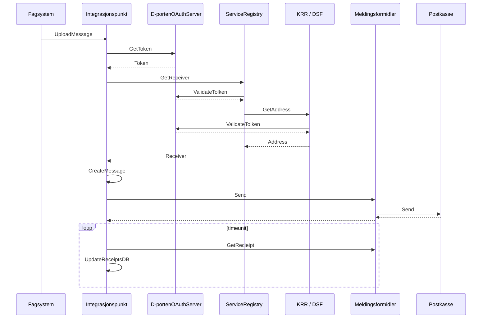

```mermaid
sequenceDiagram
    participant fs as Fagsystem
    participant ip as Integrasjonspunkt 
    participant oidc as ID-portenOAuthServer
    participant sr as ServiceRegistry
    participant krr as KRR / DSF
    participant mf  as Meldingsformidler
    participant pk as Postkasse 

    fs-Xip: UploadMessage
    ip->>oidc: GetToken
    oidc-->>ip: Token
    ip->>sr: GetReceiver
    sr->>oidc: ValidateTolken
    oidc-->>sr: 
    sr->>krr: GetAddress
    krr->>oidc: ValidateTolken
    oidc-->>krr: 
    krr-->>sr:Address
    sr-->>ip: Receiver
    ip->>ip: CreateMessage
    ip->>mf: Send
    mf->>pk:Send
    pk-->>mf: 
    mf-->>ip: 
    loop timeunit 
        ip->>mf: GetRecieipt
        ip->>ip: UpdateReceiptsDB
    end 
```
